| **1. 启动页** | **2. 首页列表** | **3. 地图页** |
| :---: | :---: | :---: |
| 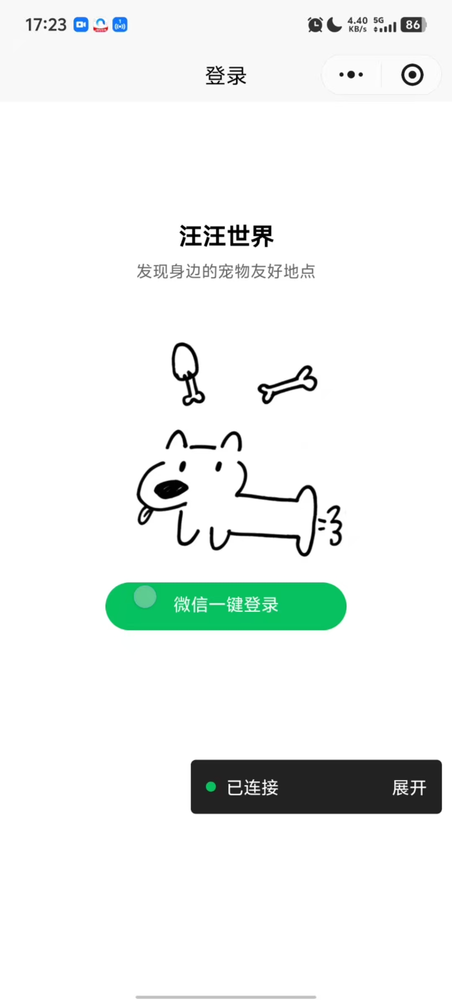 | 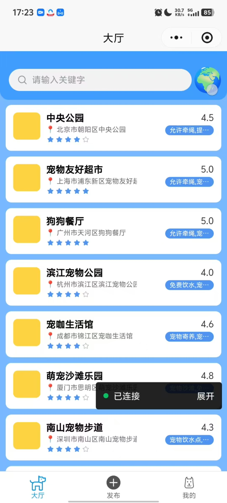 | 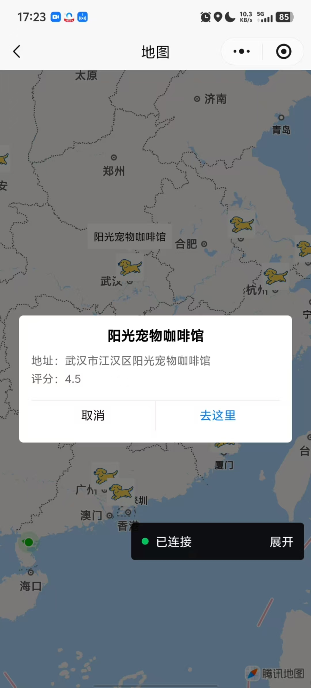 |

| **4. 详情页** | **5. 发布页** | **6. 个人中心** |
| :---: | :---: | :---: |
| 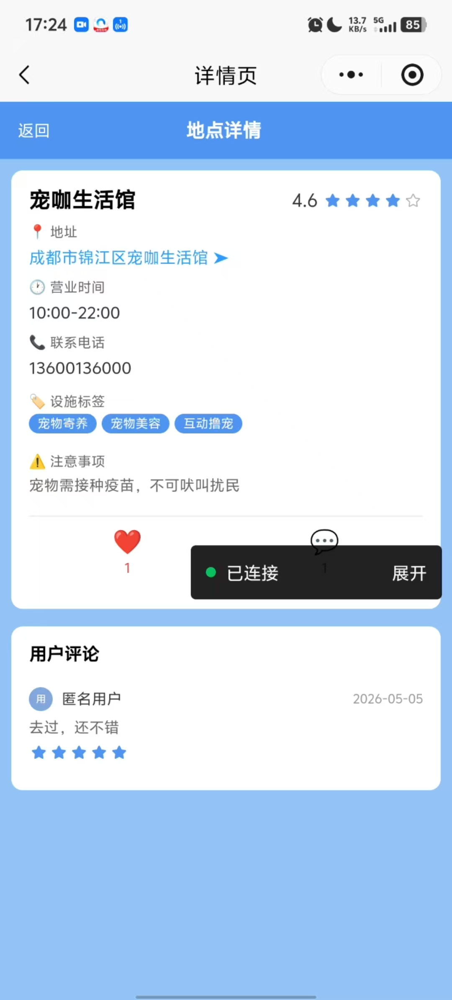 | 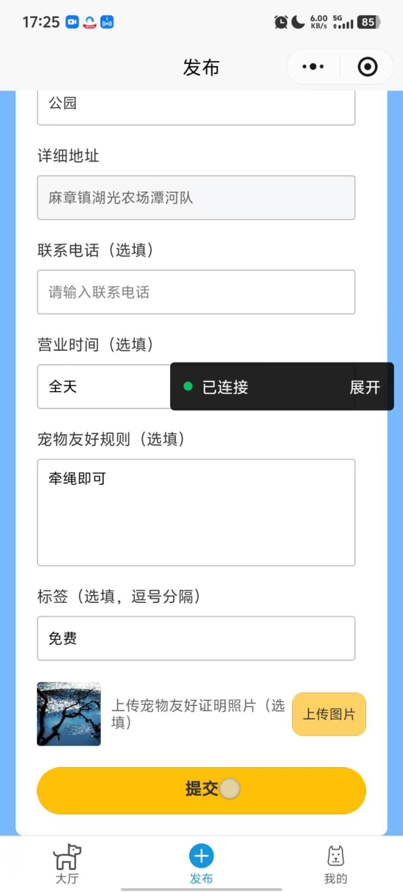 | 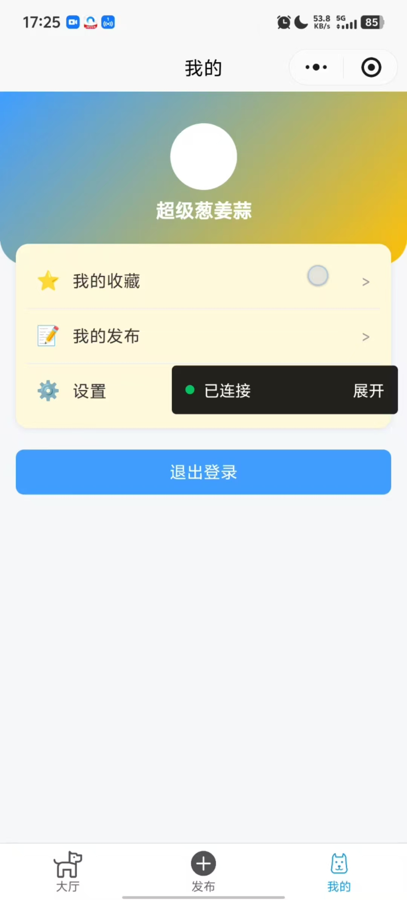 |

| **7. 收藏列表** | **8. 我的发布** | **9. 我的设置** |
| :---: | :---: | :---: |
| 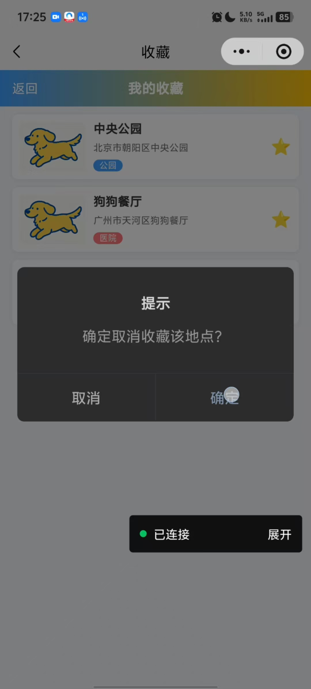 | 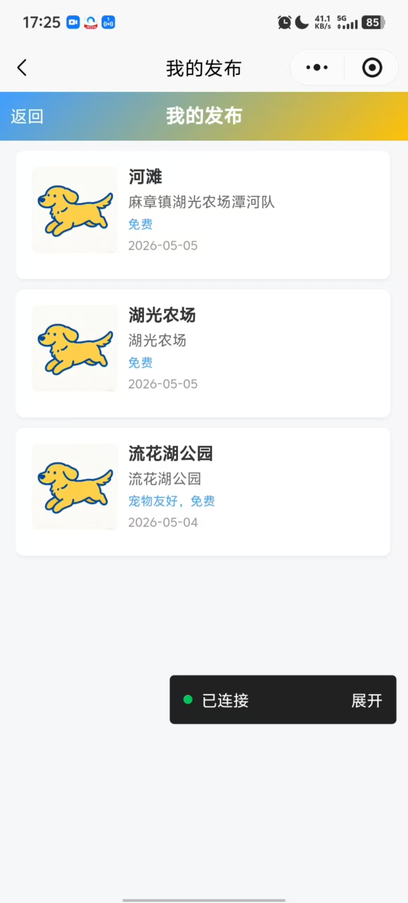 | 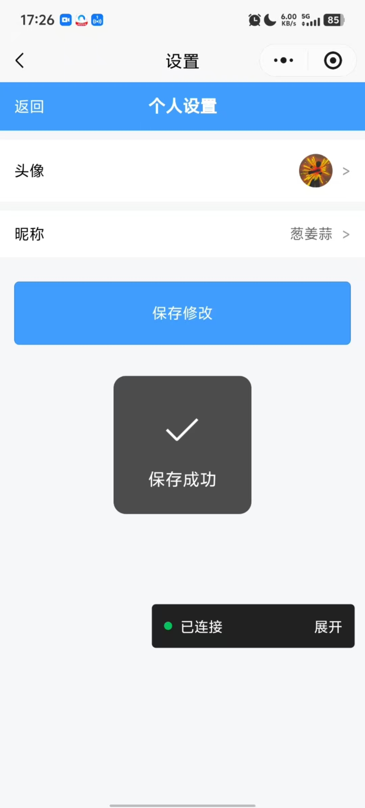 |

| **10. AI 智能问答助手** |
| :---: |
| 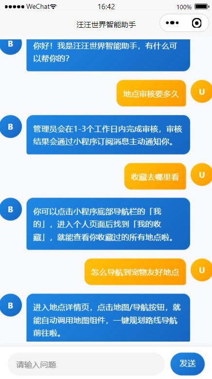 |
| **11. 后台仪表盘** | **12. 后台地点管理** | **13. 后台审核** |
| :---: | :---: | :---: |
| 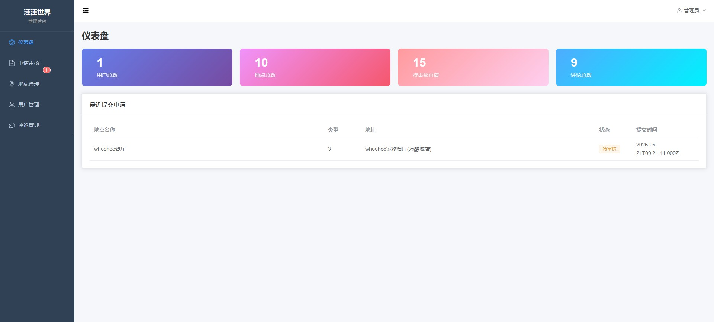 | 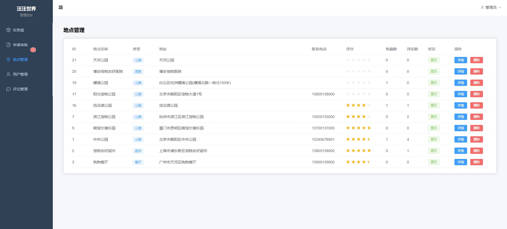 | 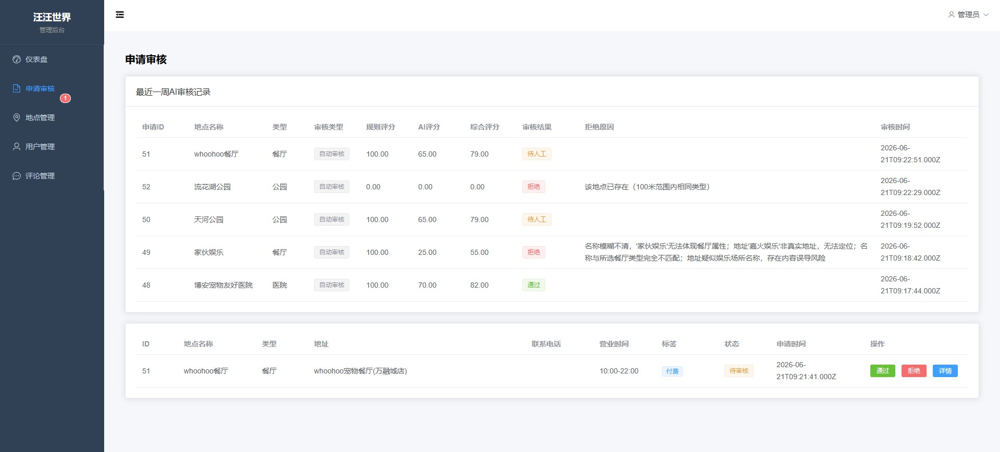 |

| **14. 后台用户管理** | **15. 后台评论管理** |
| :---: | :---: |
| 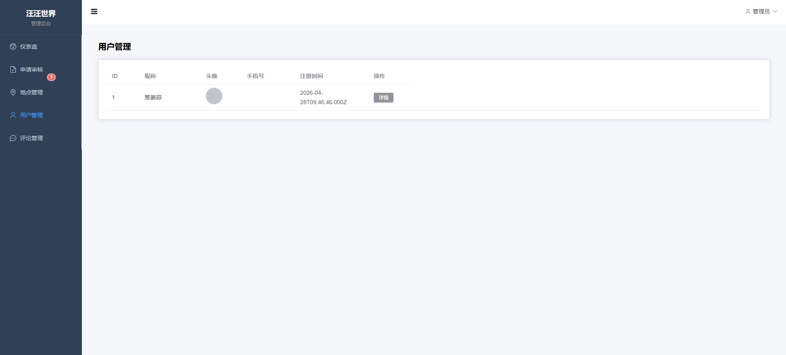 | 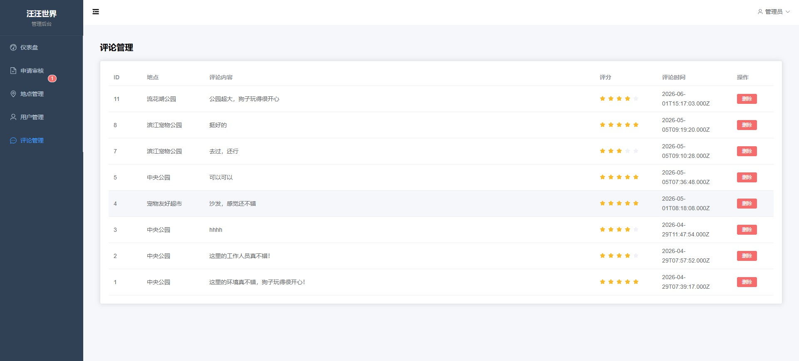 |
